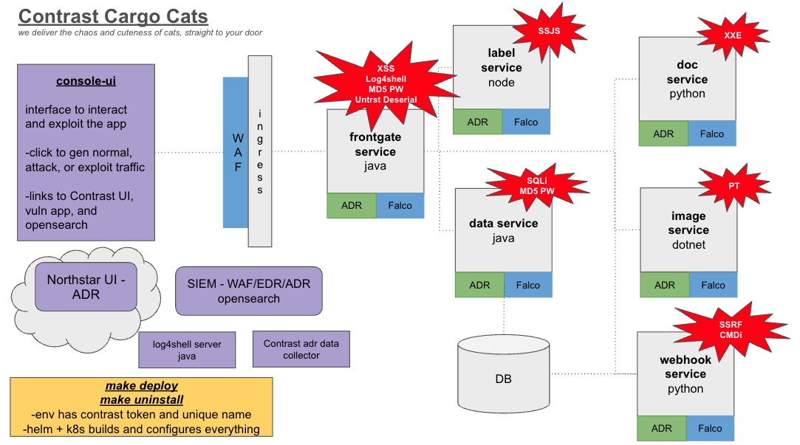
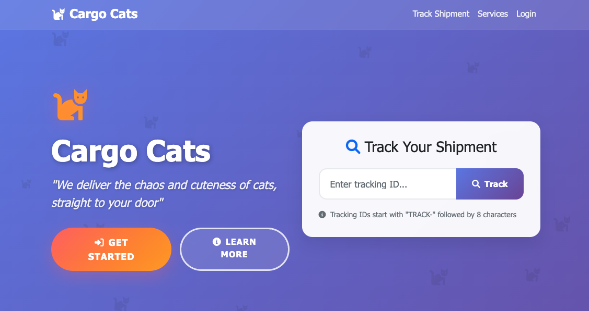
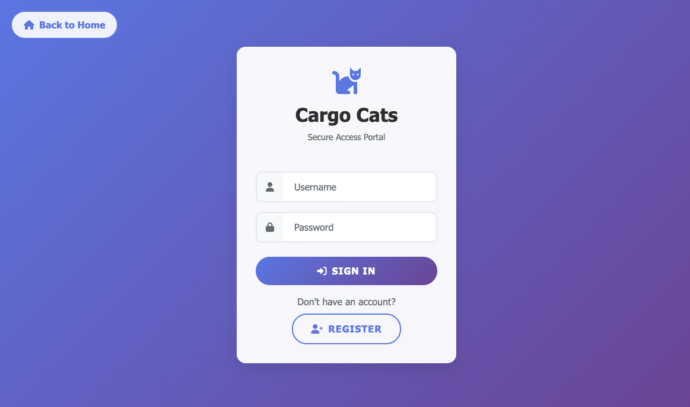
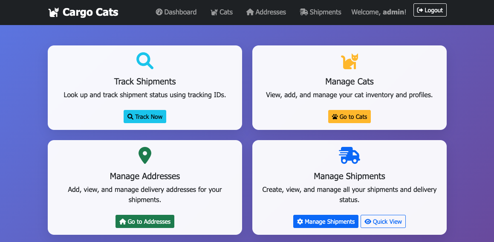
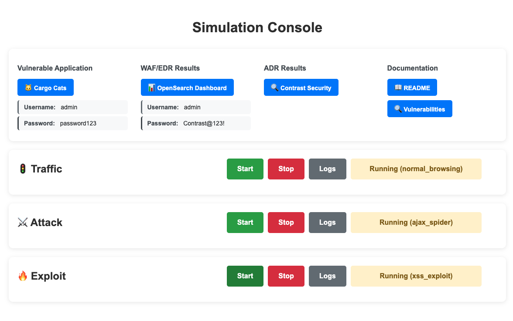
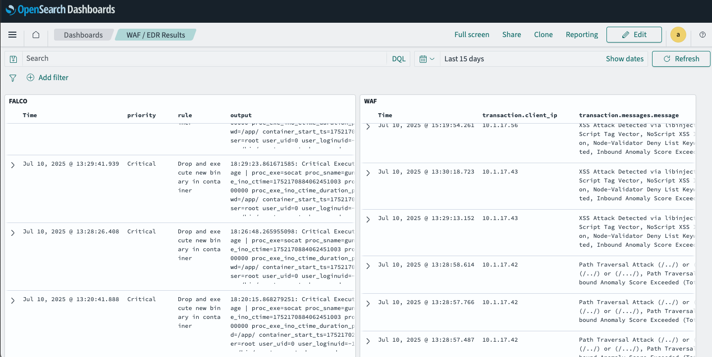

# Global Shipping 📦

Global Shipping is a multi-language microservice application designed as a purposefully vulnerable demo application for security testing and education. It simulates a shipping/logistics platform with various intentional security vulnerabilities. All services are automatically instrumented using the Contrast Security Flex Agent via agent-operator for runtime application security monitoring.

A dedicated simulation console provides a centralized interface for controlling traffic patterns, including normal user behavior, attack simulations, and exploit scenarios. This allows you to generate realistic traffic and security events to demonstrate how different security tools detect and respond to threats.

The application includes other styles of monitoring with ModSecurity WAF running on the ingress pod for web application firewall protection, and Falco installed on each pod for OS based runtime security monitoring. All logs from these security tools are collected in a built-in OpenSearch instance with preconfigured dashboards for centralized monitoring and analysis.
<div align="center">

</div>
<div align="center">
  
  
  
  
  
</div>

## Architecture

### Vulnerable Application Services

The core application consists of six intentionally vulnerable microservices:

- **Frontgateservice** (Java/Spring Boot) - Web frontend, authentication, and API gateway to other services
- **Dataservice** (Java/Spring Boot) - Handles data operations and payment processing
- **Webhookservice** (Python/Flask) - Handles webhook notifications
- **Imageservice** (C#/.NET) - Manages photo uploads and file operations
- **Labelservice** (Node.js) - Generates shipping labels and handles address processing
- **Docservice** (Python/Flask) - DOCX document processor

### Simulation and Monitoring Tools

The deployment includes comprehensive security monitoring and traffic simulation capabilities:

- **Simulation Console** - Traffic simulation and testing control center with links to all necessary tools
- **Exploit Server** - Hosts the log4shell payload
- **Contrast Agent Operator** - Runtime application security monitoring and instrumentation using the Contrast Flex agent for all services
- **ModSecurity WAF** - Web application firewall protection on ingress pods
- **Falco** - Runtime security monitoring for OS-level threats
- **OpenSearch** - Centralized log collection and analysis with preconfigured dashboards


### 📋 Vulnerability Documentation

For detailed information about the security vulnerabilities present in this application, including exploitation steps and attack scenarios, see the **[Security Vulnerabilities Documentation](vulnerabilities.md)**.

This documentation covers:
- Cross-Site Scripting (XSS)
- SQL Injection
- Log4Shell (CVE-2021-44228)
- Server-Side Request Forgery (SSRF)
- Command Injection
- Path Traversal
- XML External Entity (XXE) Injection
- Server-Side JavaScript Injection (SSJS)
- Untrusted Deserialization
- Weak Password Storage (MD5 Hashing)
- Missing Authentication
- Insecure Session Management - HTTPonly missing

## Prerequisites

Before you can deploy Cargo Cats, ensure you have the following installed:

1. **Docker Desktop** with Kubernetes enabled
   - Install Docker Desktop
   - Go to Settings → Kubernetes → Enable Kubernetes
   - Wait for Kubernetes to start (green indicator)

2. **Helm** (Kubernetes package manager)
   ```bash
   # macOS with Homebrew
   brew install helm
   
   # Or download from: https://helm.sh/docs/intro/install/
   ```

3. **kubectl** (usually comes with Docker Desktop)

## Setup

1. **Clone the repository**
   ```bash
   git clone <repository-url>
   cd cargo-cats
   ```

2. **Configure environment variables**
   ```bash
   cp env.example .env
   ```
   
   Edit the `.env` file and set the required values:
   ```bash
   CONTRAST__AGENT__TOKEN=your-contrast-agent-token
   CONTRAST__UNIQ__NAME=your-unique-name
   ```
      **Note**: The `CONTRAST__UNIQ__NAME` value will be used to ensure your application and server names are unique in the Contrast UI, preventing conflicts with other deployments.


   **Optional**: For advanced features, you can also set these additional environment variables:
   ```bash
   CONTRAST__API__KEY=your-api-key
   CONTRAST__API__AUTHORIZATION=your-authorization-header
   ```
   
   
   **Note**: The optional `CONTRAST__API__KEY` and `CONTRAST__API__AUTHORIZATION` variables enable ADR data fetching into OpenSearch and ADR deletion functionality when deployed in certain environments. These are not required for basic operation.

## Deployment

Once you have completed the setup, deploy the application with a single command:

```bash
make deploy
```

This command will:
1. Validate your environment variables
2. Build all Docker containers for the microservices
3. Deploy the application using Helm
4. Deploy the security monitoring tools (WAF, Falco, Contrast ADR)
5. Deploy OpenSearch to aggregate WAF/EDR logs
6. Deploy Simulation Console to simulate traffic and provide easy access to tools.

## Accessing the Application

After deployment completes (may take a few minutes), you can access:

- **Vulnerable Application**: http://app.localhost
  - Username: `admin`
  - Password: `password123`

- **Simulation Console**: http://console.localhost
  - Centralized control center providing links to all necessary tools
  - Controls for simulating normal traffic patterns
  - Attack traffic simulation (non-exploitative testing)
  - Exploit traffic generation for security testing

- **OpenSearch Dashboard**: http://opensearch.localhost
  - Username: `admin`
  - Password: `Contrast@123!`

## Cleanup

To remove the application and all associated resources:

```bash
make uninstall
```

This will remove the Helm deployment and delete the contrast-agent-operator namespace.

---

**Remember**: This application is intentionally vulnerable and should only be used in secure, isolated environments for testing and educational purposes.
